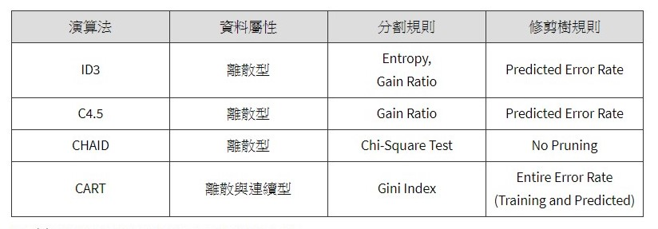

```{r setup, include=FALSE}
knitr::opts_chunk$set(echo = TRUE)
```

## Reference

1. [決策樹(Decision Tree)以及隨機森林(Random Forest)介紹](https://medium.com/jameslearningnote/%E8%B3%87%E6%96%99%E5%88%86%E6%9E%90-%E6%A9%9F%E5%99%A8%E5%AD%B8%E7%BF%92-%E7%AC%AC3-5%E8%AC%9B-%E6%B1%BA%E7%AD%96%E6%A8%B9-decision-tree-%E4%BB%A5%E5%8F%8A%E9%9A%A8%E6%A9%9F%E6%A3%AE%E6%9E%97-random-forest-%E4%BB%8B%E7%B4%B9-7079b0ddfbda)

2. [Learning Model : Decision Tree (1)-分類樹](https://medium.com/ai%E5%8F%8D%E6%96%97%E5%9F%8E/learning-model-decision-tree-1-%E5%88%86%E9%A1%9E%E6%A8%B9-5fbffd943c13)

3. [Decision Tree 決策樹 | CART, Conditional Inference Tree, RandomForest](https://www.jamleecute.com/decision-tree-cart-%E6%B1%BA%E7%AD%96%E6%A8%B9/)

4. [將資料化為資訊：Divide and Conquer - Decision Trees(2/2)](https://ithelp.ithome.com.tw/articles/10157287)

5. [Information gain ratio](https://en.wikipedia.org/wiki/Information_gain_ratio)

6. [機器學習：決策樹總結｜ID3 C4.5/C5.0 CHAID CART與QUEST](https://kknews.cc/zh-tw/tech/m36obez.html)


7. [决策树（decision tree）(一)——构造决策树方法](https://blog.csdn.net/u012328159/article/details/70184415)

8. [HOW DECISION TREE ALGORITHM WORKS](http://dataaspirant.com/2017/01/30/how-decision-tree-algorithm-works/)





